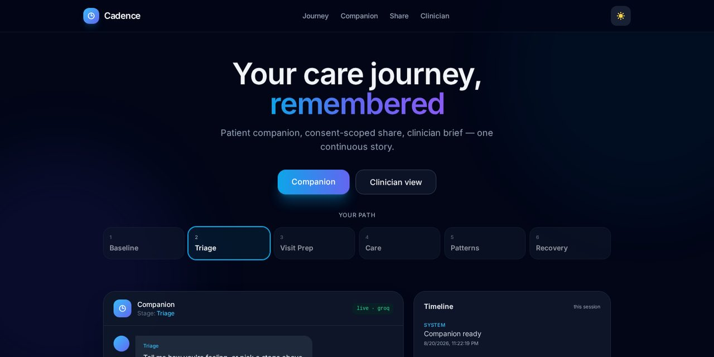
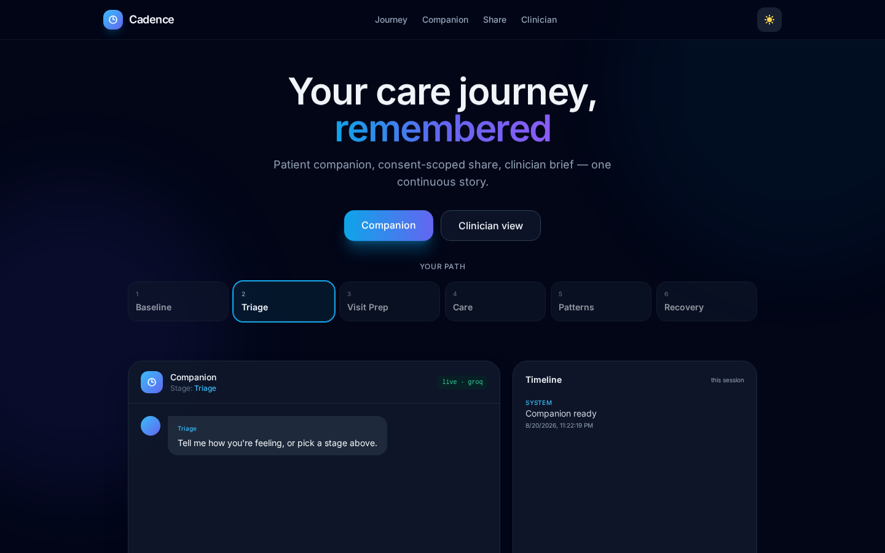
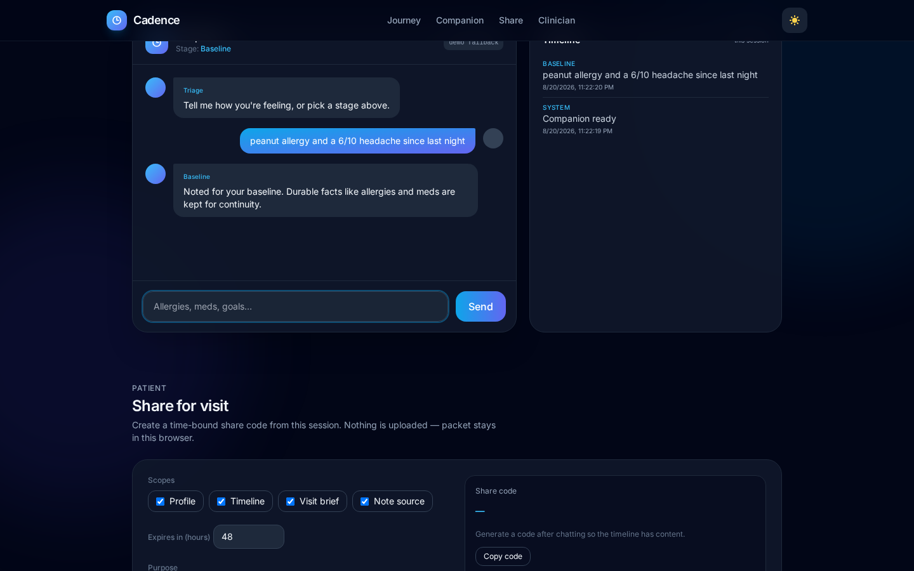
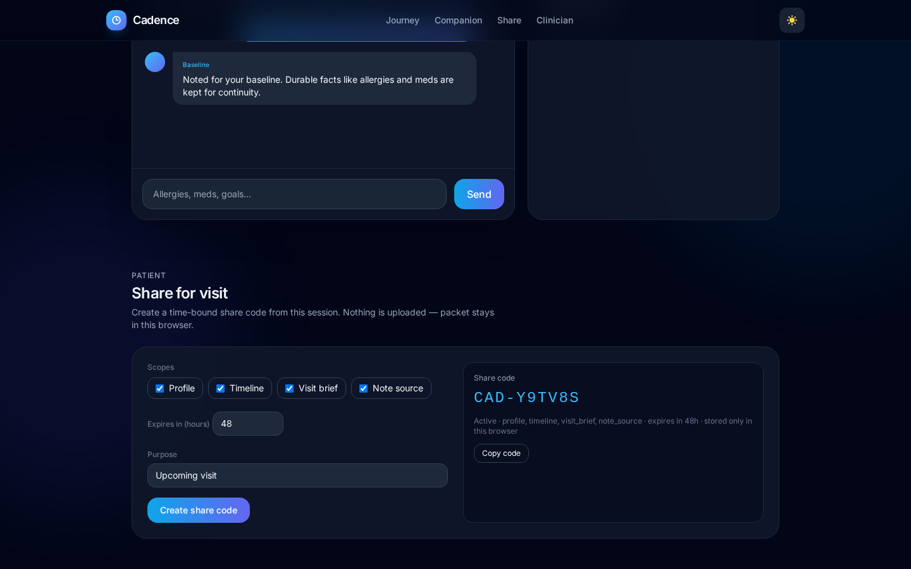
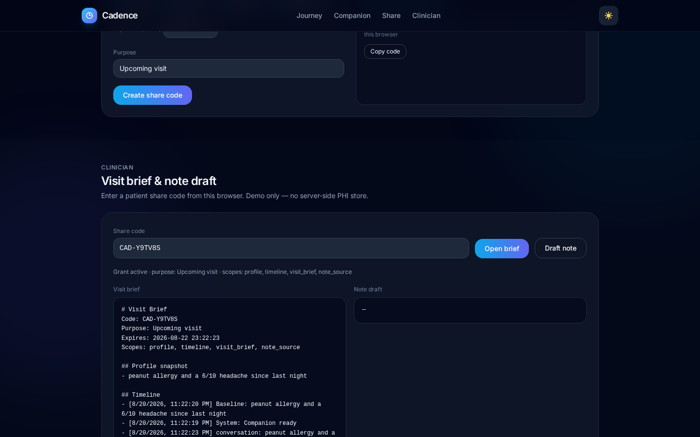

#  Cadence

**Deep-memory vertical agents for healthcare** — pure Python, fully local, zero agentic frameworks.

[](https://cadence-healthcare.vercel.app/)
[](https://github.com/devtechedge/healthcare-deep-memory-agents/actions/workflows/ci.yml)
[](https://www.python.org/downloads/)
[](LICENSE)
[](https://github.com/devtechedge/healthcare-deep-memory-agents/releases/tag/v0.2.0)

> **Disclaimer**: Educational / research prototype only. Never use for real medical decisions. Always consult qualified clinicians.

## Live Demo

https://cadence-healthcare.vercel.app/

> **Status:** Public UI is a client-side companion + share-code clinician brief. Live chat uses Groq `llama-3.3-70b-versatile` (env `OPENAI_API_KEY` on Vercel). If the key is missing or Groq errors, the badge switches to **demo fallback**. Full multi-layer memory + consent grants run locally (`python run_patient.py` / `python run_clinician.py` + Ollama). Do not enter real PHI.

## Screenshots

<p align="center">
  
</p>

| Overview | Companion |
| --- | --- |
|  |  |

| Share code | Clinician brief |
| --- | --- |
|  |  |

---

## What it is

Vertical AI agents that remember — symptoms, history, preferences — across sessions.

- Multi-layer deep memory (session · episodic · semantic · knowledge · insights)
- Pure Python only (no LangChain, CrewAI, AutoGen, Mem0…)
- Fully local & free (Ollama + SQLite + sentence-transformers)
- Consent-scoped clinician brief / note draft
- **Patient journey first**: Baseline → Triage → Visit Prep → Care → Pattern → Recovery

---

## Tech stack

| Layer | Choice |
|-------|--------|
| Agents | Pure Python (no LangChain / CrewAI / Mem0) |
| Local LLM | Ollama (`llama3.1`) |
| Live UI chat | Groq `llama-3.3-70b-versatile` via Vercel `/api/chat` |
| Memory | SQLite + sentence-transformers (injectable embedder) |
| Consent | Scope-gated grants + audit table |
| UI | Static HTML / Tailwind CDN on Vercel |

---

## Quick Start

```bash
# 1. Ollama
ollama pull llama3.1

# 2. Python
python -m venv .venv
source .venv/bin/activate          # Windows: .venv\Scripts\activate
pip install -r requirements.txt

# 3a. Patient journey (recommended)
python run_patient.py

# 3b. Single triage agent
python run_agent.py

# 3c. Clinician grant / brief / note
python run_clinician.py grant --patient demo --clinician dr_lee --hours 48
```

Force a stage:

```bash
python run_patient.py --stage VISIT_PREP
```

In-session: type `/stage CARE` to switch.

Memory lives in `data/` and survives restarts (gitignored).

### Tests

```bash
pip install -r requirements-dev.txt
python -m pytest -q
npm ci && npx playwright install chromium && npm run test:e2e
```

---

## Patient journey stages

| Stage | Agent | Role |
|-------|-------|------|
| BASELINE | Baseline | Profile, allergies, meds, goals |
| TRIAGE | Triage | Symptom structure + cautious red flags |
| VISIT_PREP | VisitPrep | Questions + brief for the clinician visit |
| CARE | CareCompanion | Adherence, side effects, care-plan tasks |
| PATTERN | Pattern | Hypothesis correlations from memory |
| RECOVERY | Recovery | Milestones and “what better looks like” |

Spec: [`docs/PATIENT_JOURNEY.md`](docs/PATIENT_JOURNEY.md)

---

## Architecture

### Memory Layers
1. **Session / Working** – recent turns  
2. **Episodic** – timestamped events, symptoms, visits  
3. **Semantic** – vector long-term facts  
4. **Knowledge** – local RAG over guidelines  
5. **Insights** – synthesized patterns (human-verified)

---

## Project Structure

```
healthcare-deep-memory-agents/
├── docs/screenshots/        ← product screenshots
├── run_patient.py           ← patient journey CLI
├── run_clinician.py         ← grant / brief / note CLI
├── src/memory/              ← DeepMemory + ConsentStore
├── src/agents/
├── web/                     ← Cadence UI (Vercel)
├── tests/                   ← pytest (no torch / Ollama)
├── e2e/                     ← Playwright smokes
└── data/                    ← local DB (gitignored)
```

---

## Security

See [`SECURITY.md`](SECURITY.md). Educational prototype. Public chat messages go to Groq when live mode is on.

---

## License

MIT (code). Any medical content you add keeps its original license.
